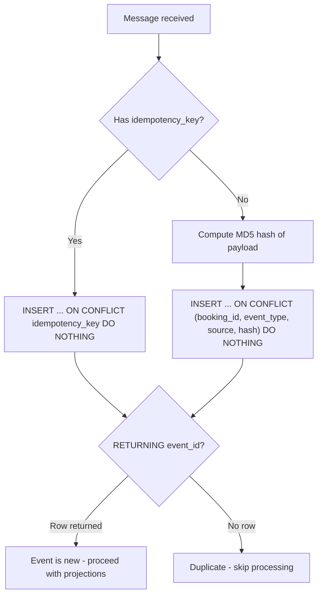

# event-saver API Contracts

## HTTP API

**event-saver exposes no public HTTP API.** All processing is driven by RabbitMQ message consumption. There are no HTTP endpoints for event ingestion, querying, or proxying.

The only HTTP endpoints are health probes and metrics (`main.py`):

| Endpoint | Probe | Behaviour |
|---|---|---|
| `GET /health` | Liveness (k8s `livenessProbe`) | Always `200 {"status": "ok"}`; no dependency calls |
| `GET /ready` | Readiness (k8s `readinessProbe`) | `SELECT 1` against PostgreSQL; `200 {"status": "ready", "checks": {"database": true}}` or `503 {"status": "not_ready", "checks": {"database": false}}` |
| `GET /metrics` | Prometheus scrape | `prometheus_client.generate_latest`; `200`, `text/plain; version=0.0.4` |

### Exposed metrics (`metrics.py`)

| Metric | Type | Labels |
|---|---|---|
| `messages_processed_total` | counter | `queue`, `event_type` (`unknown` for unparseable messages), `outcome` (ok/retried/rejected) |
| `message_processing_seconds` | histogram | `queue` |
| `saver_events_total` | counter | `event_type` — raw events persisted (duplicates excluded) |
| `saver_booking_lifecycle_total` | counter | `action` (created/rescheduled/reassigned/cancelled/rejected/client_reassigned) |

Outcome mapping: `ok` = saved; `retried` = transient retries exhausted, NACK + requeue;
`rejected` = poison message dead-lettered (parse failure or non-transient save error).

---

## RabbitMQ Consumption Contract

event-saver is a **consumer-only** service. It subscribes to queues on a durable topic exchange and processes messages as CloudEvents.

### Exchange Configuration

| Property | Value | Reference |
|---|---|---|
| Exchange name | `events` (configurable via `RABBIT_EXCHANGE`) | `config.py:116` |
| Exchange type | `topic` | `ioc.py:88` |
| Durable | Yes | `ioc.py:89` |

### Consumed Queues

Queues are derived from routing rules in `config.py:8-90`. The consumer subscribes to the set returned by `Settings.topology_queues` (`config.py:134-136`), which defaults to all unique routing destinations.

| Queue Name | Binding Key | Event Types | Source |
|---|---|---|---|
| `events.booking.lifecycle` | `events.booking.lifecycle` | `booking.created`, `booking.rescheduled`, `booking.reassigned`, `booking.cancelled`, `booking.reminder_sent` | `*` |
| `events.booking.reminder` | `events.booking.reminder` | `booking.reminder_sent` (literal) | `*` |
| `events.chat.lifecycle` | `events.chat.lifecycle` | `chat.created`, `chat.deleted` | `*` |
| `events.chat.activity` | `events.chat.activity` | `chat.message_sent` | `*` |
| `events.meeting.lifecycle` | `events.meeting.lifecycle` | `booking.events.v1.meeting.url_created.create`, `booking.events.v1.meeting.url_deleted.create` | `*` |
| `events.notification.delivery` | `events.notification.delivery` | `booking.events.v1.notification.email.message_sent.create`, `booking.events.v1.notification.telegram.message_sent.create` | `*` |
| `events.jitsi` | `events.jitsi` | `*` (any type) | `jitsi*` |
| `events.mail` | `events.mail` | `unisender.events.v1.transactional.status.create` | `unisender-go` |
| `events.chat` | `events.chat` | `getstream.*` | `getstream` |
| `events.unrouted` | `events.unrouted` | (fallback - no rule matched) | any |

Reference: `config.py:8-90`, `routing.py:30-68`

### Queue Declaration

Queues are subscribed with `declare=True` and the following arguments:

```python
RabbitQueue(
    name=queue_name,
    durable=True,
    routing_key=queue_name,
    declare=True,
    arguments={
        "x-dead-letter-exchange": "events.dlx",
        "x-dead-letter-routing-key": queue_name,
        "x-max-priority": 10,
    },
)
```

Reference: `adapters/consumer.py:53-59`

**Important**: The DLX exchange `events.dlx` must be pre-created by infrastructure. The service does not declare it.

### Expected CloudEvent Message Format

Messages must conform to **CloudEvents binary content mode**:

**Required headers:**
| Header | Description |
|---|---|
| `ce-id` | Unique event identifier |
| `ce-type` | Event type string (e.g., `booking.events.v1.booking.created.create`) |
| `ce-source` | Origin system (e.g., `booking`, `getstream`, `jitsi`) |
| `ce-time` | ISO 8601 timestamp |
| `ce-specversion` | CloudEvents spec version (1.0) |

**Optional headers:**
| Header | Description |
|---|---|
| `ce-booking_id` | Booking identifier for correlation |
| `ce-idempotencykey` | Deduplication key (preferred over hash) |
| `ce-traceid` | Distributed trace ID |
| `ce-spanid` | Span ID for tracing |
| `ce-dataschema` | Schema version identifier |

**Body**: JSON payload (event data).

Reference: `adapters/consumer.py:87-106`

### Retry / DLQ Behavior

| Aspect | Current State |
|---|---|
| Dead-letter exchange | `events.dlx` (configured via queue argument) |
| Retry strategy | None (FastStream default: nack on exception) |
| Delivery limit | Not configured |
| Message TTL | Not configured |

When `_consume_message` raises an exception, FastStream nacks the message. With the `x-dead-letter-exchange` argument, RabbitMQ routes nacked messages to `events.dlx`. However, no retry count or backoff is implemented at the application level.

Reference: `adapters/consumer.py:85-151`

---

## Event Deduplication

event-saver uses two deduplication strategies, selected per-event:

### Strategy 1: Idempotency Key (preferred)

When the incoming CloudEvent includes `ce-idempotencykey`:

```sql
INSERT INTO events (..., idempotency_key, ...)
VALUES (...)
ON CONFLICT (idempotency_key) DO NOTHING
RETURNING event_id
```

If `RETURNING` yields no row, the event is a duplicate and processing stops.

Reference: `infrastructure/persistence/repositories/event_repository.py:31-75`

### Strategy 2: Legacy Hash Constraint (fallback)

When no idempotency key is present:

```sql
INSERT INTO events (..., hash, ...)
VALUES (...)
ON CONFLICT (booking_id, event_type, source, hash) DO NOTHING
RETURNING event_id
```

The hash is computed as `hashlib.md5(json.dumps(payload, sort_keys=True).encode()).hexdigest()` in Python (`json` standard library with `sort_keys=True` for stable key ordering).

Reference: `infrastructure/persistence/repositories/event_repository.py:77-120`, `domain/services/event_parser.py:82-85`

### Deduplication Flow



