# event-saver Data Model

All tables are owned by event-saver. Schema migrations are managed via Alembic in `event-saver/alembic/versions/`.

## ER Diagram

```mermaid
erDiagram
    events {
        text event_id PK
        text booking_id "nullable"
        text event_type "not null"
        text source "not null"
        text hash "not null"
        timestamptz occurred_at "not null"
        timestamptz received_at "not null, default now()"
        jsonb payload "not null"
        text idempotency_key "nullable, unique"
        text trace_id "nullable"
        text span_id "nullable"
        text dataschema "nullable"
    }

    bookings {
        bigserial id PK
        text booking_uid "not null, unique"
        timestamptz first_seen_at "not null"
        timestamptz last_seen_at "not null"
        timestamptz start_time "nullable"
        timestamptz end_time "nullable"
        text current_status "nullable"
        uuid organizer_user_id "nullable"
        uuid client_user_id "nullable"
        timestamptz created_at "not null, default now()"
        timestamptz updated_at "not null, default now()"
    }

    booking_organizer_history {
        bigserial id PK
        bigint booking_ref_id "not null, FK bookings.id"
        uuid organizer_user_id "not null"
        text source_event_id "nullable"
        timestamptz effective_from "not null"
        timestamptz created_at "not null, default now()"
    }

    booking_meeting_links {
        bigserial id PK
        bigint booking_ref_id "not null"
        uuid user_id "nullable"
        text meeting_url "not null"
        text source_event_id "nullable"
        timestamptz occurred_at "not null"
        timestamptz created_at "not null, default now()"
        timestamptz updated_at "not null, default now()"
    }

    booking_email_notifications {
        bigserial id PK
        bigint booking_ref_id "not null"
        uuid user_id "nullable"
        text trigger_event "nullable"
        text job_id "not null, unique"
        text sent_event_id "nullable"
        timestamptz sent_at "nullable"
        text last_status "nullable"
        timestamptz last_status_event_time "nullable"
        text last_status_event_id "nullable"
        text last_clicked_url "nullable"
        timestamptz created_at "not null, default now()"
        timestamptz updated_at "not null, default now()"
    }

    booking_email_status_history {
        bigserial id PK
        bigint notification_ref_id "not null, FK booking_email_notifications.id"
        text status "nullable"
        timestamptz status_event_time "nullable"
        text clicked_url "nullable"
        text source_event_id "not null, unique"
        timestamptz created_at "not null, default now()"
    }

    booking_telegram_notifications {
        bigserial id PK
        bigint booking_ref_id "not null"
        uuid user_id "nullable"
        text trigger_event "nullable"
        text source_event_id "not null, unique"
        timestamptz sent_at "not null"
        timestamptz created_at "not null, default now()"
    }

    booking_chat_events {
        bigserial id PK
        bigint booking_ref_id "not null"
        text raw_event_id "not null, unique"
        text provider "not null"
        text chat_event_type "not null"
        text message_id "nullable"
        uuid user_id "nullable"
        boolean is_read "nullable"
        text text_preview "nullable"
        timestamptz occurred_at "not null"
        timestamptz updated_at "not null, default now()"
    }

    booking_video_events {
        bigserial id PK
        bigint booking_ref_id "not null"
        text raw_event_id "not null, unique"
        text video_event_type "not null"
        text participant_role "nullable"
        uuid user_id "nullable"
        timestamptz event_time "nullable"
        jsonb payload "not null, default {}"
    }

    booking_lifecycle_events {
        bigserial id PK
        bigint booking_ref_id "not null, FK bookings.id"
        text raw_event_id "not null, FK events.event_id"
        text action "not null"
        uuid organizer_user_id "nullable"
        uuid client_user_id "nullable"
        jsonb details "nullable"
        timestamptz occurred_at "not null"
        timestamptz created_at "not null, default now()"
    }

    bookings ||--o{ booking_organizer_history : "has history"
    bookings ||--o{ booking_meeting_links : "has links"
    bookings ||--o{ booking_email_notifications : "has emails"
    bookings ||--o{ booking_telegram_notifications : "has telegrams"
    bookings ||--o{ booking_chat_events : "has chats"
    bookings ||--o{ booking_video_events : "has video"
    bookings ||--o{ booking_lifecycle_events : "has lifecycle"
    events ||--o{ booking_lifecycle_events : "sourced by"
    booking_email_notifications ||--o{ booking_email_status_history : "has status history"
```

## Table Details

### `events` - Raw Event Storage

The immutable append-only log of all received CloudEvents.

| Column | Type | Constraints | Notes |
|---|---|---|---|
| `event_id` | text | PK | CloudEvent `ce-id` |
| `booking_id` | text | nullable | Extracted from `ce-bookingid` |
| `event_type` | text | not null | CloudEvent `ce-type` |
| `source` | text | not null | CloudEvent `ce-source` |
| `hash` | text | not null | `md5(json.dumps(payload, sort_keys=True))` — informational, not a dedup key |
| `occurred_at` | timestamptz | not null | CloudEvent `ce-time` |
| `received_at` | timestamptz | not null, default `now()` | Server-side receipt time |
| `payload` | jsonb | not null | Event data body |
| `idempotency_key` | text | nullable, unique | Primary dedup key |
| `trace_id` | text | nullable | Distributed tracing |
| `span_id` | text | nullable | Distributed tracing |
| `dataschema` | text | nullable | Schema version |

**Indexes:**
- `ix_events_booking_id_occurred_at_desc` on `(booking_id, occurred_at DESC)`
- `ix_events_event_type_occurred_at_desc` on `(event_type, occurred_at DESC)`
- `idx_events_idempotency` partial unique on `idempotency_key` (WHERE idempotency_key IS NOT NULL, migration `c5d7f9e3a1b2`)
- `idx_events_trace_id` partial on `trace_id`
- The legacy `uq_events_booking_id_event_type_source_hash` unique index was dropped (migration `a9d4c1f0b7e2`); `hash` is informational only

Reference: `db/models.py:11-46`

### `bookings` - Normalized Booking Projection

| Column | Type | Constraints | Notes |
|---|---|---|---|
| `id` | bigserial | PK | Internal reference ID |
| `booking_uid` | text | unique | External booking identifier |
| `first_seen_at` | timestamptz | not null | First event timestamp |
| `last_seen_at` | timestamptz | not null | Most recent event timestamp |
| `start_time` | timestamptz | nullable | Scheduled start |
| `end_time` | timestamptz | nullable | Scheduled end |
| `current_status` | text | nullable | `created`, `cancelled` |
| `organizer_user_id` | uuid | nullable | FK to event-users |
| `client_user_id` | uuid | nullable | FK to event-users |
| `created_at` | timestamptz | not null, default `now()` | |
| `updated_at` | timestamptz | not null, default `now()` | |

**Indexes:**
- `uq_bookings_booking_uid` unique on `booking_uid`
- `ix_bookings_last_seen_desc` on `(last_seen_at DESC)`

**Upsert semantics** (`ON CONFLICT booking_uid`):
- `last_seen_at` = `greatest(existing, new)`
- `start_time`, `end_time`, `current_status`, `organizer_user_id`, `client_user_id` = `coalesce(new, existing)`

Reference: `db/models.py:49-76`, `infrastructure/persistence/repositories/booking_repository.py:17-74`

### `booking_organizer_history` - Organizer Reassignment Audit

| Column | Type | Constraints |
|---|---|---|
| `id` | bigserial | PK |
| `booking_ref_id` | bigint | not null (FK to `bookings.id`) |
| `organizer_user_id` | uuid | not null |
| `source_event_id` | text | nullable |
| `effective_from` | timestamptz | not null |
| `created_at` | timestamptz | not null, default `now()` |

**Index:** `ix_boh_booking_effective_from_desc` on `(booking_ref_id, effective_from DESC)`

Insert logic: only inserts if the new organizer differs from the most recent history entry.

Reference: `db/models.py:79-102`, `infrastructure/persistence/repositories/booking_repository.py:100-139`

### `booking_meeting_links` - Meeting URL Projection

| Column | Type | Constraints |
|---|---|---|
| `id` | bigserial | PK |
| `booking_ref_id` | bigint | not null |
| `user_id` | uuid | nullable |
| `meeting_url` | text | not null |
| `source_event_id` | text | nullable |
| `occurred_at` | timestamptz | not null |
| `created_at` / `updated_at` | timestamptz | defaults |

**Unique:** `(booking_ref_id, user_id)`

Reference: `db/models.py:105-129`

### `booking_email_notifications` - Email Notification Projection

| Column | Type | Constraints |
|---|---|---|
| `id` | bigserial | PK |
| `booking_ref_id` | bigint | not null |
| `user_id` | uuid | nullable |
| `trigger_event` | text | nullable |
| `job_id` | text | not null, unique |
| `sent_event_id` | text | nullable |
| `sent_at` | timestamptz | nullable |
| `last_status` | text | nullable |
| `last_status_event_time` | timestamptz | nullable |
| `last_status_event_id` | text | nullable |
| `last_clicked_url` | text | nullable |
| `created_at` / `updated_at` | timestamptz | defaults |

**Unique:** `job_id`
**Indexes:** `ix_ben_booking_ref_id`, `ix_ben_booking_ref_last_status_time_desc`

Reference: `db/models.py:132-166`

### `booking_email_status_history` - Email Delivery Status History

| Column | Type | Constraints |
|---|---|---|
| `id` | bigserial | PK |
| `notification_ref_id` | bigint | not null (FK to `booking_email_notifications.id`) |
| `status` | text | nullable |
| `status_event_time` | timestamptz | nullable |
| `clicked_url` | text | nullable |
| `source_event_id` | text | not null, unique |
| `created_at` | timestamptz | defaults |

Reference: `db/models.py:190-212`

### `booking_telegram_notifications` - Telegram Notification Projection

| Column | Type | Constraints |
|---|---|---|
| `id` | bigserial | PK |
| `booking_ref_id` | bigint | not null |
| `user_id` | uuid | nullable |
| `trigger_event` | text | nullable |
| `source_event_id` | text | not null, unique |
| `sent_at` | timestamptz | not null |
| `created_at` | timestamptz | defaults |

Reference: `db/models.py:169-187`

### `booking_chat_events` - Chat Event Projection

| Column | Type | Constraints |
|---|---|---|
| `id` | bigserial | PK |
| `booking_ref_id` | bigint | not null |
| `raw_event_id` | text | not null, unique |
| `provider` | text | not null |
| `chat_event_type` | text | not null |
| `message_id` | text | nullable |
| `user_id` | uuid | nullable |
| `is_read` | boolean | nullable |
| `text_preview` | text | nullable |
| `occurred_at` | timestamptz | not null |
| `updated_at` | timestamptz | defaults |

**Indexes:** `ix_bce_booking_ref_occurred_desc`, `ix_bce_booking_ref_type_occurred_desc`

Reference: `db/models.py:215-244`

### `booking_video_events` - Video/Jitsi Event Projection

| Column | Type | Constraints |
|---|---|---|
| `id` | bigserial | PK |
| `booking_ref_id` | bigint | not null |
| `raw_event_id` | text | not null, unique |
| `video_event_type` | text | not null |
| `participant_role` | text | nullable |
| `user_id` | uuid | nullable |
| `event_time` | timestamptz | nullable |
| `payload` | jsonb | not null, default `'{}'` |

**Indexes:** `ix_bve_booking_ref_event_time_desc`, `ix_bve_booking_ref_type_event_time_desc`

Reference: `db/models.py:247-268`

### `booking_lifecycle_events` - Booking Lifecycle Audit Log

Records every lifecycle action (created, cancelled, rescheduled, reassigned) as an immutable append-only log linked to the raw source event.

| Column | Type | Constraints |
|---|---|---|
| `id` | bigserial | PK |
| `booking_ref_id` | bigint | not null (FK to `bookings.id`) |
| `raw_event_id` | text | not null (FK to `events.event_id`) |
| `action` | text | not null |
| `organizer_user_id` | uuid | nullable |
| `client_user_id` | uuid | nullable |
| `details` | jsonb | nullable |
| `occurred_at` | timestamptz | not null |
| `created_at` | timestamptz | not null, default `now()` |

**Indexes:** `ix_ble_booking_ref_occurred_desc` on `(booking_ref_id, occurred_at DESC)`

---

### `blacklist_entries` — booking blacklist

Owned by event-admin at runtime (writes are a sanctioned exception, same as `admin_users`); event-booking reads it through the event-admin API. event-saver only owns the migration and drift-guard model.

| Column | Type | Constraints |
|---|---|---|
| `id` | uuid | PK, default `gen_random_uuid()` |
| `field` | text | not null (open string; `client_email` today) |
| `value` | text | not null (stored lowercased for `client_email`) |
| `is_active` | boolean | not null, default `true` |
| `active_from` | timestamptz | nullable (NULL = unbounded) |
| `active_until` | timestamptz | nullable (NULL = unbounded) |
| `comment` | text | nullable |
| `created_by` | text | not null |
| `created_at` | timestamptz | not null, default `now()` |
| `updated_at` | timestamptz | not null, default `now()` |

**Indexes:** `ix_blacklist_entries_field_lower_value` on `(field, lower(value))`

---

## Business Invariants at DB Level

1. **Event uniqueness (idempotency)**: partial `UNIQUE(idempotency_key)` ensures exactly-once storage when key is present; the `event_id` PK absorbs broker redelivery. Inserts use a bare `ON CONFLICT DO NOTHING`
2. **Booking identity**: `UNIQUE(booking_uid)` ensures one booking record per external ID
3. **Email notification identity**: `UNIQUE(job_id)` maps one notification record per email job
4. **Chat/Video/Telegram uniqueness**: `UNIQUE(raw_event_id)` or `UNIQUE(source_event_id)` on all projection tables prevents duplicate projections from reprocessed events
5. **Meeting link uniqueness**: `UNIQUE(booking_ref_id, user_id)` ensures one link per user per booking
6. **Organizer history**: Insert-only-if-changed logic prevents duplicate consecutive entries

---

## Migration Chain

Ordered by dependency (each revision depends on the one above):

| # | Revision | Description |
|---|---|---|
| 1 | `9bb09c895183` | Create `events` table |
| 2 | `5f1c2e9a8b1d` | Add `hash` column for deduplication |
| 3 | `3a791de67f88` | Make `booking_id` nullable |
| 4 | `b2c4f8a1d9e3` | Add booking projection tables (`bookings`, `booking_organizer_history`, `booking_meeting_links`, `booking_email_notifications`, `booking_telegram_notifications`, `booking_chat_events`, `booking_video_events`) |
| 5 | `31c851c306e9` | Delete `recipient_role` column |
| 6 | `4c0ec66f1c56` | Delete `recipient_role` (another table) |
| 7 | `9db481e61abb` | Delete `recipient_role` (cleanup) |
| 8 | `188a4a37868a` | Add `is_read` to chat events |
| 9 | `b0e296cc4b17` | Add `updated_at` to `booking_chat_events` |
| 10 | `afce66b11b80` | Add `start_time` and `end_time` to bookings |
| 11 | `c5d7f9e3a1b2` | Add `idempotency_key`, `trace_id`, `span_id`, `dataschema` columns |
| 12 | `ea_0001` | Create `admin_users` table (event-admin branch) |
| 13 | `89ec847d44a9` | Merge event-admin and main heads |
| 14 | `f3a9b2c1d4e5` | Add `user_id` to participants / `booking_email_status_history` table |
| 15 | `28bba7523965` | Remove `participants` table, add UUID columns to bookings |
| 16 | `ca7326cf2ec5` | Create `booking_lifecycle_events` table |
| 17 | `2af87f34c2ff` | Merge event-admin and lifecycle heads |
| 18 | `a1b2c3d4e5f6` | Add `recipient_email` to notification tables |
| 19 | `16939138e5a7` | Merge recipient_email migration head |
| 20 | `a9d4c1f0b7e2` | Drop legacy `(booking_id, event_type, source, hash)` dedup index |
| 21 | `d8f2a6c41b39` | Create `blacklist_entries` table (written by event-admin, read by event-booking via the event-admin API) |

Reference: `alembic/versions/`
