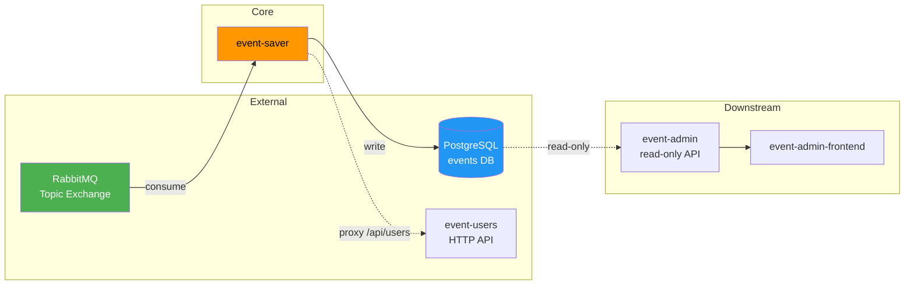

# event-saver Dependencies

## Depends On

### RabbitMQ (message broker)

| Aspect | Detail |
|---|---|
| Protocol | AMQP 0-9-1 via aio-pika (FastStream) |
| Connection | `RABBIT_URL` env var |
| Exchange | `events` (topic, durable) |
| Queues consumed | 10 queues (see API_CONTRACTS.md) |
| Role | Consumer only (no publish in production flow) |
| Failure mode | Service cannot start if broker unreachable; existing connections drop messages to DLX |

Reference: `ioc.py:73-90`, `adapters/consumer.py:47-75`

### PostgreSQL (database)

| Aspect | Detail |
|---|---|
| Protocol | asyncpg (SQLAlchemy 2.x async) |
| Connection | `POSTGRES_DSN` env var |
| Pool | size=10, max_overflow=20, pool_pre_ping=True |
| Role | **Schema owner** and exclusive writer |
| Tables | 9 tables (see DATA_MODEL.md) |
| Migrations | Alembic (`alembic/versions/`, 15 revisions) |
| Failure mode | Event processing halts; messages nacked and routed to DLX |

Reference: `ioc.py:130-155`

### event-users (HTTP service)

| Aspect | Detail |
|---|---|
| Protocol | HTTP (httpx AsyncClient) |
| Connection | `USERS_SERVICE_URL` + `USERS_SERVICE_API_TOKEN` |
| Role | Proxied user lookups (non-critical to core event flow) |
| Failure mode | Proxy endpoints return HTTP errors; core event ingestion unaffected |

Reference: `ioc.py:288-298`, `main.py:55-77`

---

## Provides To

### event-admin (read-only database access)

event-admin connects to the **same PostgreSQL database** owned by event-saver but with read-only access. It queries all projection tables and the raw `events` table to serve the admin UI.

| What event-admin reads | Purpose |
|---|---|
| `events` | Raw event log, timeline views |
| `bookings` | Booking list, detail, status |
| `booking_organizer_history` | Reassignment audit trail |
| `booking_meeting_links` | Meeting URLs per booking |
| `booking_email_notifications` | Email delivery tracking |
| `booking_email_status_history` | Delivery status timeline |
| `booking_telegram_notifications` | Telegram notification log |
| `booking_chat_events` | Chat activity per booking |
| `booking_video_events` | Video/Jitsi session data |

**Contract**: event-admin must not write to or migrate the database. All schema changes are made exclusively via event-saver's Alembic.

### event-admin-frontend (indirect)

The frontend calls event-admin's API, which reads event-saver's database. event-saver has no direct relationship with the frontend.

---

## Dependency Diagram

---

## What Breaks If event-saver Goes Down

| Impact | Affected System | Severity | Recovery |
|---|---|---|---|
| Events accumulate in RabbitMQ queues | RabbitMQ | Medium | Messages preserved (durable queues); auto-recovers on restart |
| No new projections written | PostgreSQL / event-admin | High | Admin UI shows stale data; no data loss |
| No new bookings tracked | event-admin-frontend | High | Bookings list stops updating |
| Proxy user endpoints fail | event-admin-frontend (if using event-saver proxy) | Low | Frontend should fall back to event-users directly |
| No organizer history recorded | Audit trail | Medium | History gap; cannot be retroactively filled without replay |
| DLX fills up | RabbitMQ | Low | If event-saver is down long, DLX queues grow; monitor disk |

### Recovery Strategy

1. **Restart event-saver** -- queued messages will be consumed in order
2. **Message ordering**: Within a single queue, messages are consumed FIFO. Cross-queue ordering is not guaranteed but not required (each queue handles independent event types).
3. **Idempotency**: Re-delivery of already-processed messages is safe due to deduplication constraints.
4. **No replay mechanism**: There is currently no built-in way to replay events from the raw `events` table through projections. If projections fail silently (known limitation), that data is lost unless the source re-emits.

---

## Version Compatibility Notes

| Dependency | Minimum Version | Notes |
|---|---|---|
| Python | 3.14 | Uses `StrEnum`, modern type syntax |
| PostgreSQL | 14+ | JSONB, `generated always as` support |
| RabbitMQ | 3.10+ | Dead-letter exchange, delivery limits |
| SQLAlchemy | 2.0+ | Async engine, `mapped_column` |
| FastStream | 0.5+ | RabbitBroker subscriber API |
| Dishka | 1.0+ | Async container, scope management |
