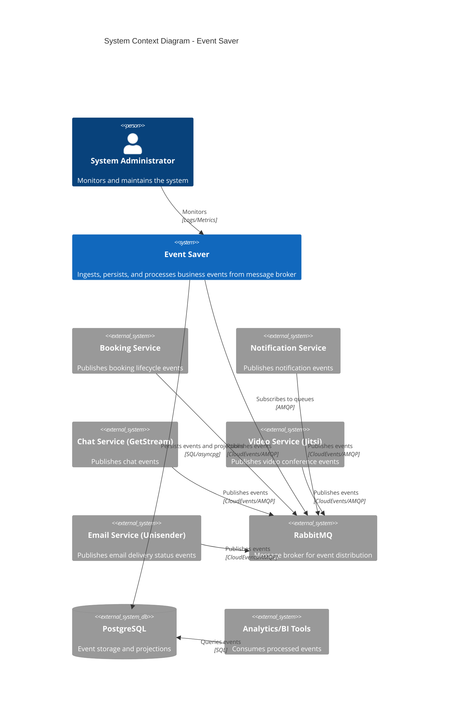
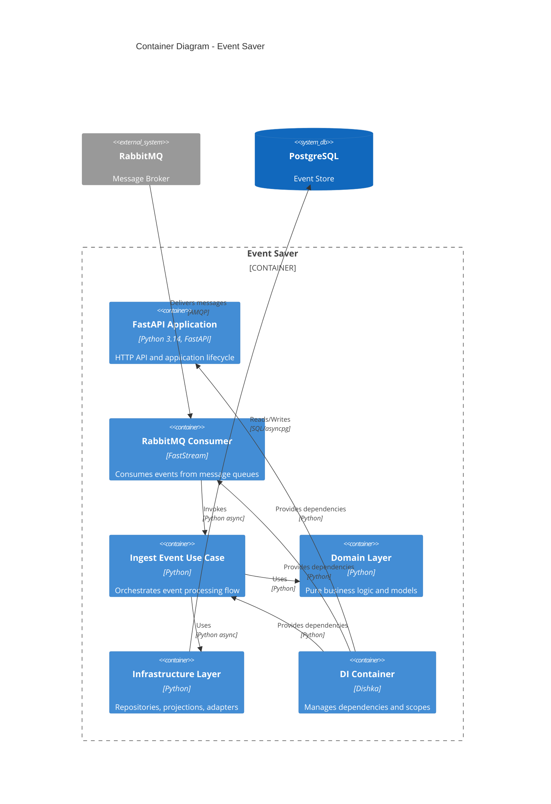
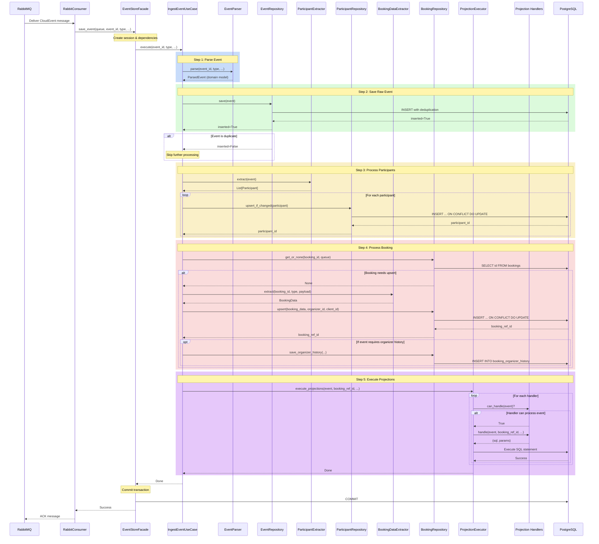
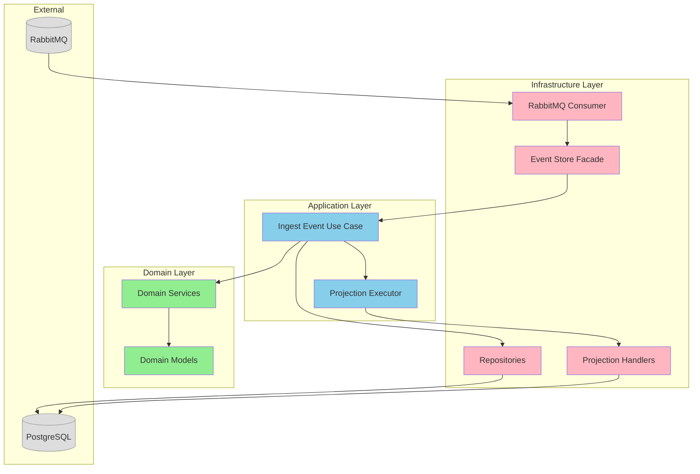
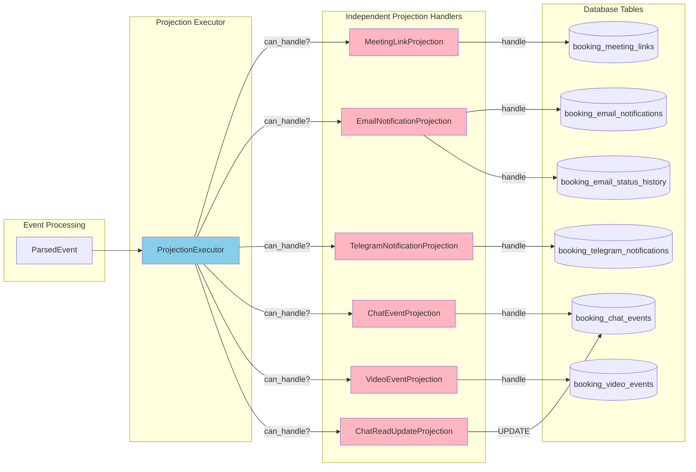
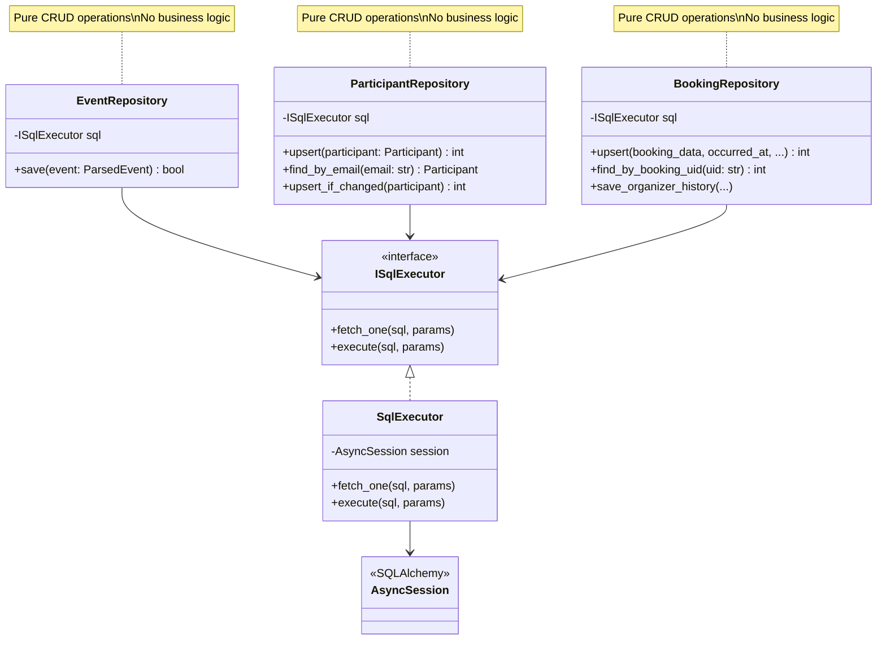

# C4 Architecture Diagrams

C4 модель документирует архитектуру event-saver на 4 уровнях абстракции.

## Level 1: System Context Diagram

Показывает event-saver в контексте внешних систем и пользователей.



---

## Level 2: Container Diagram

Показывает основные контейнеры внутри event-saver.



---

## Level 3: Component Diagram

Показывает внутреннюю структуру event-saver (Clean Architecture).

```mermaid
C4Component
    title Component Diagram - Event Saver (Clean Architecture)

    Container_Boundary(domain_layer, "Domain Layer") {
        Component(models, "Domain Models", "Dataclasses", "ParsedEvent, Participant, BookingData - immutable value objects")
        Component(event_parser, "Event Parser", "Service", "Parses CloudEvents into domain models")
        Component(participant_extractor, "Participant Extractor", "Service", "Extracts participants from payloads")
        Component(booking_extractor, "Booking Data Extractor", "Service", "Extracts booking data from events")
    }

    Container_Boundary(application_layer, "Application Layer") {
        Component(ingest_use_case, "IngestEventUseCase", "Use Case", "Orchestrates entire event ingestion flow")
        Component(projection_executor, "ProjectionExecutor", "Service", "Executes projection handlers")
    }

    Container_Boundary(infrastructure_layer, "Infrastructure Layer") {
        Component(event_repo, "EventRepository", "Repository", "CRUD for raw events table")
        Component(participant_repo, "ParticipantRepository", "Repository", "CRUD for participants table")
        Component(booking_repo, "BookingRepository", "Repository", "CRUD for bookings table")

        Component(meeting_proj, "MeetingLinkProjection", "Handler", "Projects meeting links")
        Component(email_proj, "EmailNotificationProjection", "Handler", "Projects email notifications")
        Component(telegram_proj, "TelegramNotificationProjection", "Handler", "Projects telegram notifications")
        Component(chat_proj, "ChatEventProjection", "Handler", "Projects chat events")
        Component(video_proj, "VideoEventProjection", "Handler", "Projects video events")

        Component(event_store_facade, "EventStoreFacade", "Adapter", "Adapts use case to IEventStore interface")
        Component(consumer, "RabbitConsumer", "Adapter", "Consumes messages from RabbitMQ")
    }

    SystemDb(postgres, "PostgreSQL", "Database")
    System_Ext(rabbitmq, "RabbitMQ", "Message Broker")

    ' Domain dependencies (none - pure logic)
    Rel(event_parser, models, "Creates")
    Rel(participant_extractor, models, "Creates")
    Rel(booking_extractor, models, "Creates")

    ' Application depends on domain
    Rel(ingest_use_case, event_parser, "Uses")
    Rel(ingest_use_case, participant_extractor, "Uses")
    Rel(ingest_use_case, booking_extractor, "Uses")
    Rel(ingest_use_case, event_repo, "Uses")
    Rel(ingest_use_case, participant_repo, "Uses")
    Rel(ingest_use_case, booking_repo, "Uses")
    Rel(ingest_use_case, projection_executor, "Uses")

    ' Projection executor uses handlers
    Rel(projection_executor, meeting_proj, "Executes")
    Rel(projection_executor, email_proj, "Executes")
    Rel(projection_executor, telegram_proj, "Executes")
    Rel(projection_executor, chat_proj, "Executes")
    Rel(projection_executor, video_proj, "Executes")

    ' Infrastructure depends on database
    Rel(event_repo, postgres, "SQL INSERT")
    Rel(participant_repo, postgres, "SQL UPSERT")
    Rel(booking_repo, postgres, "SQL UPSERT")
    Rel(meeting_proj, postgres, "SQL UPSERT")
    Rel(email_proj, postgres, "SQL UPSERT")
    Rel(telegram_proj, postgres, "SQL UPSERT")
    Rel(chat_proj, postgres, "SQL INSERT/UPDATE")
    Rel(video_proj, postgres, "SQL INSERT")

    ' Adapters
    Rel(event_store_facade, ingest_use_case, "Delegates to")
    Rel(consumer, event_store_facade, "Calls")
    Rel(rabbitmq, consumer, "Delivers events")

    UpdateLayoutConfig($c4ShapeInRow="3", $c4BoundaryInRow="1")
```

---

## Sequence Diagram: Event Ingestion Flow

Показывает последовательность обработки одного события.



---

## Dependency Flow (Clean Architecture)

Показывает направление зависимостей (всегда внутрь).



**Ключевой принцип:** Зависимости всегда направлены внутрь:
- 🔴 Infrastructure → Application → Domain
- ✅ Domain ← Application ← Infrastructure

---

## Projection System Architecture

Показывает как работает система проекций.



**Особенности:**
- Каждая проекция независима
- Проекция решает сама: `can_handle(event)` → `handle(event)`
- Failure одной проекции не блокирует другие
- Легко добавить новую проекцию

---

## Repository Pattern

Показывает паттерн Repository для доступа к данным.



**Принципы:**
- Repositories - только CRUD
- Вся бизнес-логика в Domain Services
- Зависимость от интерфейса (ISqlExecutor), не от реализации

---

## View these diagrams

1. **GitHub/GitLab** - поддерживают Mermaid natively
2. **VS Code** - установить расширение "Markdown Preview Mermaid Support"
3. **IntelliJ IDEA** - встроенная поддержка Mermaid в Markdown
4. **Online** - https://mermaid.live/

---

## Useful Links

- [C4 Model](https://c4model.com/)
- [Mermaid Documentation](https://mermaid.js.org/)
- [Clean Architecture](https://blog.cleancoder.com/uncle-bob/2012/08/13/the-clean-architecture.html)
