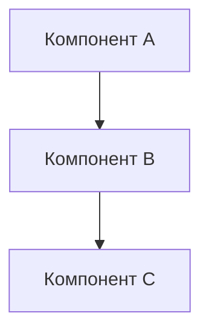
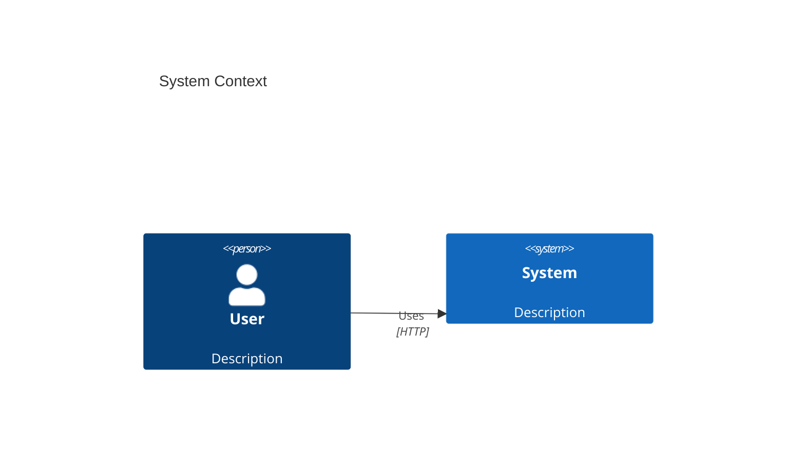
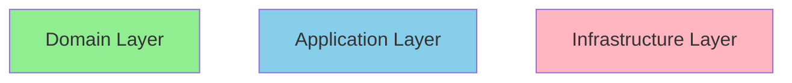
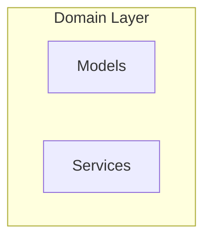

# Диаграммы - Быстрый старт

Этот документ объясняет как просматривать и редактировать архитектурные диаграммы.

## 📊 Что создано

В проекте есть полный набор C4 диаграмм:

1. **Context Diagram** - event-saver в контексте внешних систем
2. **Container Diagram** - основные контейнеры внутри системы
3. **Component Diagram** - детали Clean Architecture
4. **Sequence Diagram** - flow обработки одного события
5. **Dependency Flow** - направление зависимостей (Clean Architecture)
6. **Projection System** - архитектура системы проекций

📄 **Файл:** [C4_DIAGRAMS.md](C4_DIAGRAMS.md)

## 👀 Как просмотреть диаграммы

### Вариант 1: GitHub/GitLab (рекомендуется)

Просто откройте файл на GitHub/GitLab - Mermaid поддерживается natively:

```
https://github.com/your-repo/event-saver/blob/main/docs/architecture/C4_DIAGRAMS.md
```

### Вариант 2: VS Code

1. Установить расширение: **Markdown Preview Mermaid Support**
   ```
   code --install-extension bierner.markdown-mermaid
   ```

2. Открыть `C4_DIAGRAMS.md`

3. Нажать `Cmd+Shift+V` (macOS) или `Ctrl+Shift+V` (Windows/Linux)

### Вариант 3: IntelliJ IDEA / PyCharm

Встроенная поддержка Mermaid:
1. Открыть `C4_DIAGRAMS.md`
2. Переключиться на Preview (справа сверху)

### Вариант 4: Online

Скопировать код диаграммы и вставить на:
- https://mermaid.live/
- https://mermaid.ink/

## ✏️ Как редактировать

### Синтаксис Mermaid прост:



### C4 диаграммы



### Sequence диаграммы

```mermaid
sequenceDiagram
    Actor->>System: Request
    System->>Database: Query
    Database-->>System: Result
    System-->>Actor: Response
```

## 🎨 Стилизация

### Цвета по слоям (Clean Architecture)



- 🟢 **Domain** - светло-зеленый (#90EE90)
- 🔵 **Application** - голубой (#87CEEB)
- 🔴 **Infrastructure** - розовый (#FFB6C1)

## 📚 Полезные ресурсы

### Документация

- [Mermaid Documentation](https://mermaid.js.org/)
- [C4 Model](https://c4model.com/)
- [Mermaid Live Editor](https://mermaid.live/)

### Примеры диаграмм

- [Mermaid Examples](https://mermaid.js.org/intro/examples.html)
- [C4 Model Examples](https://c4model.com/#examples)

### Инструменты

- [Mermaid CLI](https://github.com/mermaid-js/mermaid-cli) - экспорт в PNG/SVG
- [VS Code Extension](https://marketplace.visualstudio.com/items?itemName=bierner.markdown-mermaid)

## 🔄 Workflow обновления диаграмм

### Когда обновлять диаграммы

- ✅ Добавлена новая проекция → обновить Component Diagram
- ✅ Изменился flow обработки → обновить Sequence Diagram
- ✅ Добавлена новая внешняя система → обновить Context Diagram
- ✅ Изменилась архитектура слоев → обновить все диаграммы

### Процесс

1. **Редактировать** `C4_DIAGRAMS.md`
2. **Проверить** рендеринг (VS Code preview или mermaid.live)
3. **Коммит**:
   ```bash
   git add docs/architecture/C4_DIAGRAMS.md
   git commit -m "docs: update architecture diagrams"
   ```

## 💡 Tips & Tricks

### 1. Автоматический layout

Mermaid автоматически расставляет элементы. Контроль через:

```mermaid
C4Context
    UpdateLayoutConfig($c4ShapeInRow="3", $c4BoundaryInRow="2")
```

### 2. Группировка компонентов



### 3. Экспорт в PNG/SVG

Через Mermaid CLI:

```bash
npm install -g @mermaid-js/mermaid-cli
mmdc -i diagram.mmd -o diagram.png
```

### 4. Проверка синтаксиса

Онлайн: https://mermaid.live/ (автоматическая валидация)

## 🐛 Troubleshooting

### Диаграмма не рендерится

1. **Проверить синтаксис** на mermaid.live
2. **Обновить расширение** VS Code
3. **Перезапустить** VS Code

### Элементы накладываются

1. Использовать `UpdateLayoutConfig`
2. Упростить диаграмму (разбить на несколько)
3. Изменить направление (`TD` → `LR`)

### Русский текст не отображается

Mermaid поддерживает Unicode, но:
1. Убедитесь что файл в UTF-8
2. Используйте кавычки для текста с пробелами: `A["Русский текст"]`

## 📝 Checklist для новой диаграммы

- [ ] Диаграмма рендерится корректно
- [ ] Все компоненты подписаны
- [ ] Стрелки имеют labels
- [ ] Использованы правильные цвета (Domain/Application/Infrastructure)
- [ ] Есть заголовок (`title ...`)
- [ ] Добавлено описание в документ
- [ ] Протестировано в GitHub/VS Code

## 🎯 Следующие шаги

1. **Изучить** [C4_DIAGRAMS.md](C4_DIAGRAMS.md)
2. **Просмотреть** в GitHub или VS Code
3. **Обновить** при изменении архитектуры
4. **Создать** новые диаграммы при необходимости

---

📚 **См. также:**
- [ARCHITECTURE_DECISION_RECORDS.md](ARCHITECTURE_DECISION_RECORDS.md) - Архитектурные решения
- [../REFACTORING_SUMMARY.md](../../REFACTORING_SUMMARY.md) - История рефакторинга
