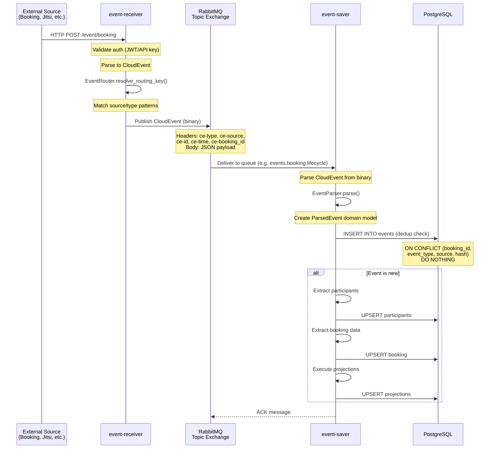
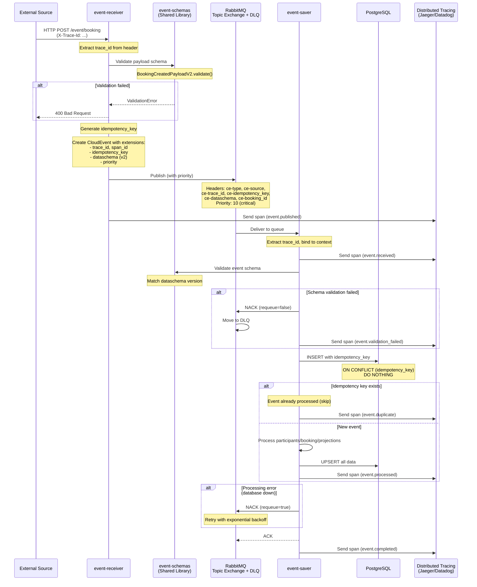
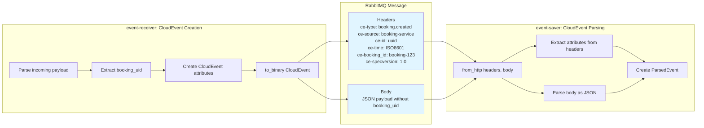
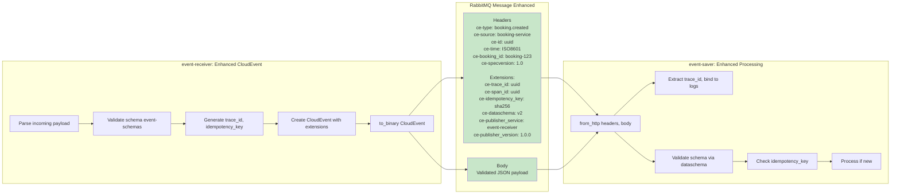
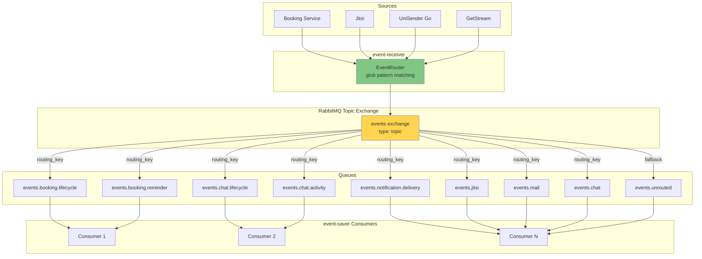
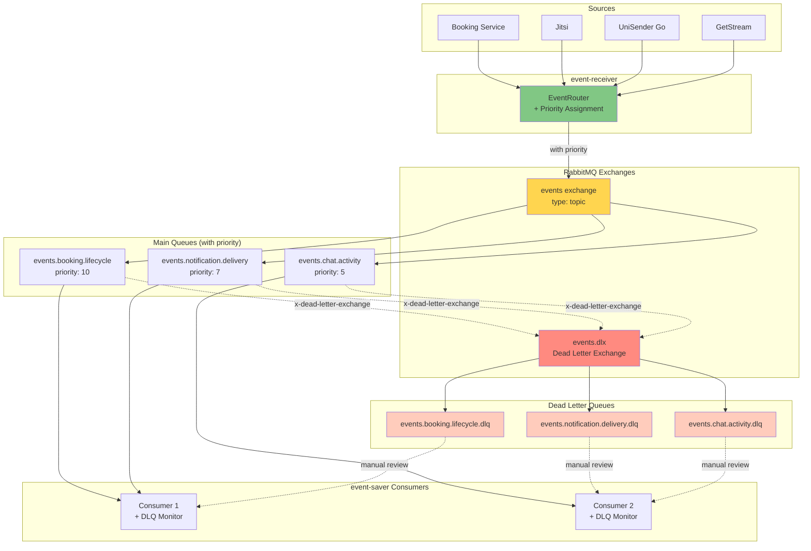
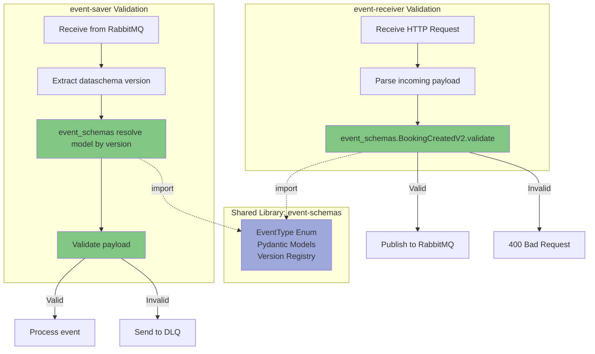
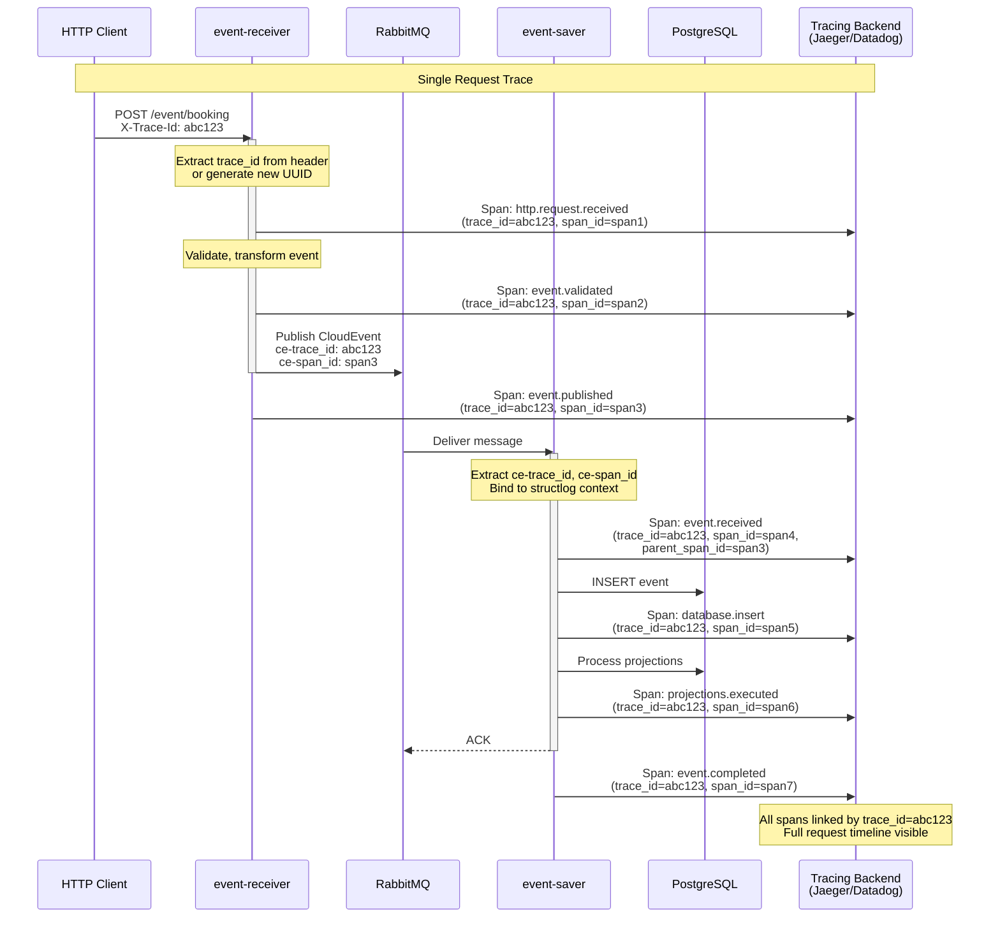
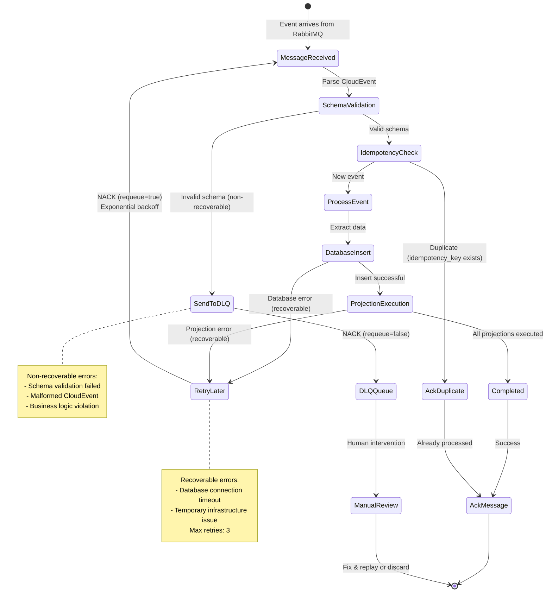
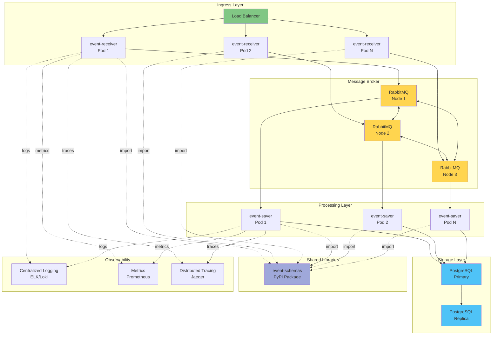

# Integration Architecture Diagrams

Диаграммы взаимодействия между event-receiver и event-saver.

---

## Current Architecture

---

## Improved Architecture (Recommended)

---

## Data Flow: CloudEvents Binary Format

### Current Format

### Improved Format (with extensions)

---

## Event Routing Topology

### Current

### Improved (with DLQ & Priority)

---

## Schema Validation Flow

---

## Distributed Tracing Flow

---

## Error Handling & DLQ

---

## Deployment Architecture

---

## Viewing These Diagrams

1. **GitHub/GitLab** - встроенная поддержка Mermaid
2. **VS Code** - расширение "Markdown Preview Mermaid Support"
3. **IntelliJ IDEA / PyCharm** - встроенный Markdown preview
4. **Online** - [mermaid.live](https://mermaid.live/)

---

## См. также

- [SERVICE_INTEGRATION_ANALYSIS.md](../SERVICE_INTEGRATION_ANALYSIS.md) - Детальный анализ и рекомендации
- [C4_DIAGRAMS.md](C4_DIAGRAMS.md) - Внутренняя архитектура event-saver
- [ARCHITECTURE_DECISION_RECORDS.md](ARCHITECTURE_DECISION_RECORDS.md) - Архитектурные решения
